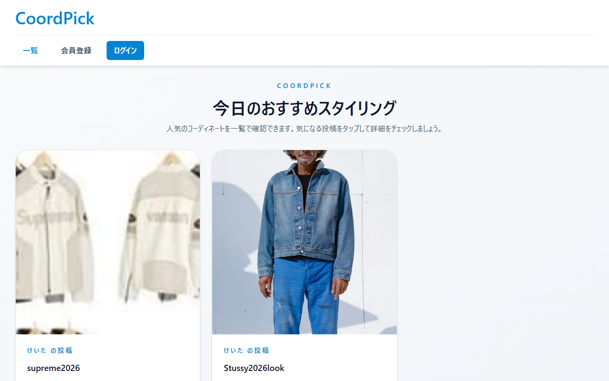
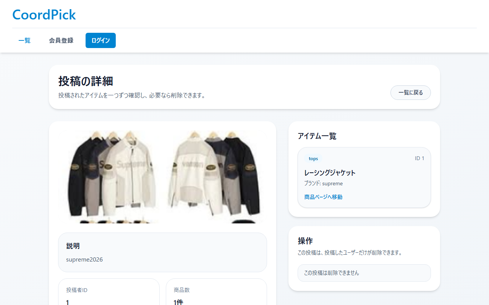
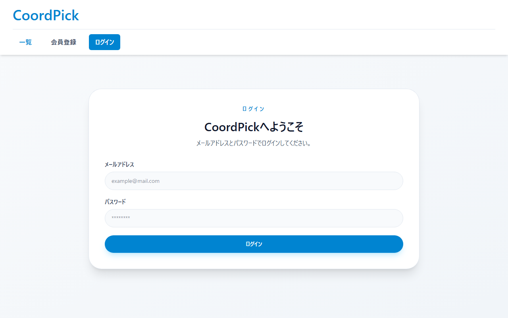

# CoordPick

SNS（TikTok/Instagram等）のコメント欄で頻発する「購入先が分からない」という課題を解決するための、ファッション特定・共有プラットフォームです。
コーディネート写真とアイテムごとの購入先URLをセットで投稿することで、見る人がすぐに欲しいアイテムにたどり着けます。

## URL
https://coord-pick.vercel.app

## 機能一覧
- ユーザー登録・ログイン（JWT認証）
- コーディネート画像とアイテム情報（アイテム名・ブランド・カテゴリ・購入先URL）の投稿
- 投稿の一覧表示・詳細表示
- 自分が投稿した内容の削除（他人の投稿は削除不可）
- 画像はCloudinaryにアップロードし、CDN経由で配信

## スクリーンショット
| 一覧 | 詳細 | ログイン |
| --- | --- | --- |
|  |  |  |

## Docker
```bash
copy .env.example .env
docker compose up --build
```

- Frontend: http://localhost:8080
- Backend API: http://localhost:8000
- API docs: http://localhost:8000/docs

`.env` の `CLOUDINARY_*` と `SECRET_KEY` は自分の値に置き換えてください。
`SECRET_KEY` が未設定、または `change-me` のままだとバックエンドは起動しません。

## 起動手順（Dockerを使わない場合）

### Backend
```bash
cd backend
pip install -r requirements.txt
uvicorn main:app --reload
```

- `/upload` エンドポイントは画像ファイルのみ受け付けます。

### Frontend
```bash
cd frontend
npm install
npm run dev
```

### テストの実行
```bash
# Backend
cd backend
pip install -r requirements-dev.txt
pytest

# Frontend
cd frontend
npm install
npm test
```

## 技術スタックと技術選定理由
### Backend
- **Python / FastAPI**:高速かつ型安全なAPI開発のため採用
- **SQLAlchemy**
- **Uvicorn**
- **pytest**:APIの認可・認証・情報漏えい防止の回帰テストに使用

### Frontend
- **TypeScript**:型定義による安全性の向上のため。
- **React (Vite)**:開発スピードとビルドパフォーマンスを重視し、Viteを採用。
- **React Router**:ページ遷移の管理に使用
- **TailwindCSS**
- **Axios**
- **Vitest / Testing Library**:ログイン・会員登録画面の挙動(バリデーション・API連携・画面遷移)のテストに使用

### Infrastructure / Tools
- **Cloudinary**:画像データの最適化配信・クラウド管理のため導入。
- **Vercel**（フロントエンド）/ **Render**（バックエンドAPI）
- **GitHub Actions**:push・PR時にbackendのテストとfrontendのlint/test/buildを自動実行
- **Docker / docker compose**:ローカル環境の再現性を担保
- **Git / GitHub**

## ディレクトリ構成
```bash
.
├── backend
│   ├── main.py      # APIエンドポイント
│   ├── models.py    # SQLAlchemyモデル
│   ├── schemas.py   # Pydanticスキーマ
│   ├── auth.py       # JWT認証・パスワードハッシュ
│   ├── db.py         # DB接続設定
│   └── tests/        # pytestによるAPIテスト
├── frontend
│   ├── src
│   │   ├── components  # 画面コンポーネント(*.test.tsxはVitestのテスト)
│   │   └── App.tsx
│   └── index.html
├── docs/screenshots   # READMEに載せているスクリーンショット
├── .github/workflows  # CI設定
└── README.md
```

## こだわり
- **型安全な設計**: FastAPIのPydanticモデルとSQLAlchemyを組み合わせ、堅牢でメンテナンス性の高いAPIを構築しました。
- **効率的な画像管理**: サーバー負荷を軽減し、高速に画像を表示させるため、Cloudinaryを採用して画像管理基盤を構築しました。
- **モダンな開発環境**: Viteを採用することで、開発体験の向上とビルドの高速化を図っています。
- **セキュリティ**: パスワードはArgon2系アルゴリズムでハッシュ化、認可が必要なAPIはJWTで保護し、レスポンスに認証情報が含まれないようスキーマを分離しています。画像アップロードもContent-Typeだけでなくファイルの実バイナリを検証しています。

## 今後の課題
- フロントエンドのテストの拡充（現状はログイン・会員登録画面のみ）
- リフレッシュトークンの導入によるログイン維持期間の改善
- 画像アップロード時のファイルサイズ上限・枚数制限のバリデーション追加
- ページネーション（現状は全投稿を一括取得しているため、投稿数が増えると性能面で課題）

## License
MIT
